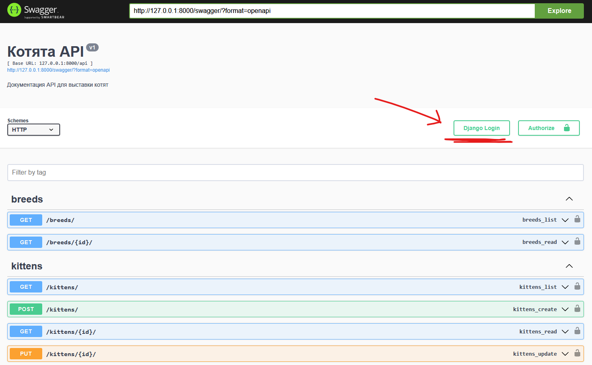

# Online Kitten API

## Описание
Это REST API для онлайн выставки котят. API позволяет пользователям добавлять котят, просматривать информацию о них, оценивать котят и управлять своими записями.

## Функциональность
- Получение списка пород котят.
- Получение списка всех котят.
- Получение котят определенной породы.
- Получение подробной информации о котенке.
- Добавление, изменение и удаление информации о котенке.
- Оценка котят пользователями (от 1 до 5).
- JWT авторизация пользователей.

## Требования
- Python 3.9+
- PostgreSQL
- Docker и Docker Compose (для контейнеризации)

### 1. Запуск с помощью Docker
##### 1.1 Создание образов и запуск контейнеров
Запустите Docker Compose для сборки и запуска приложения:
```bash
docker-compose up --build
```
##### 1.2 Доступ к приложению
После запуска контейнеров, приложение будет доступно по адресу: http://127.0.0.1:8000/.

### 2. Документация API
Документация API доступна по следующему адресу: http://127.0.0.1:8000/swagger/.

### 3. Как использовать токены после входа
Получите токены через POST /api/token/: После успешного входа вы получите токены в формате JSON.
Используйте токены в заголовках: Для защищенных запросов, например, к KittenViewSet или RatingViewSet, добавьте заголовок Authorization со значением Bearer <access_token>.

### 4. Удобный способ входа
<div style="display: flex; justify-content: space-between;">

  
  

</div>

### Минимальные данные для тестирования
Создание суперпользователя для доступа к админ-панели и управлению данными:
```bash
python manage.py createsuperuser
```

### Тестирование
Для тестирования API используйте pytest. Убедитесь, что тесты написаны в файле tests.py. Запустите тесты командой:
```bash
pytest
```